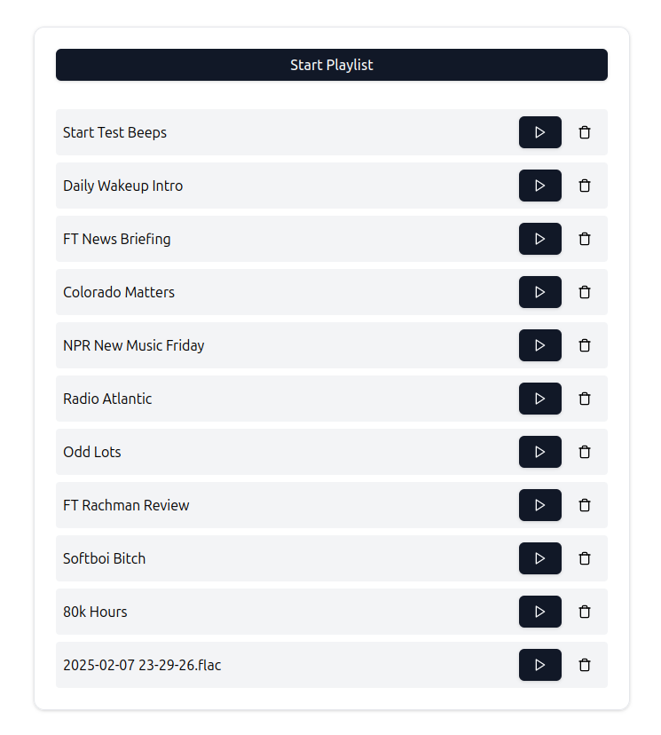

# Infinity Stream

Infinity Stream is a Python-based media streaming and queue management solution that uses Trello as a control interface. With Infinity Stream, you attach media files to Trello cards and the system automatically downloads, processes, and streams these files over HTTP. Manage your media queue via Trello and control playback using the web interface.

## Table of Contents

- [Features](#features)
- [Screenshot](#screenshot)
- [Quick Start with Docker](#quick-start-with-docker)
- [Environment Variables](#environment-variables)
- [Development Setup](#development-setup)
- [Deployment](#deployment)
  - [Using DigitalOcean App Platform](#using-digitalocean-app-platform)
- [Usage](#usage)
  - [Working with Trello](#working-with-trello)
  - [Customizing the Web Player](#customizing-the-web-player)
- [Supported Media Formats](#supported-media-formats)
- [Technical Overview](#technical-overview)
- [GitHub Actions / Docker Publish](#github-actions--docker-publish)
- [Troubleshooting](#troubleshooting)
- [License](#license)

## Features

- **Trello-Driven Queue:** Manage your media queue via Trello cards.
- **Automated Processing:** Downloads and processes media files attached to Trello cards.
- **HTTP Streaming:** Streams media files over HTTP for simple playback via a web interface.
- **Docker-Ready:** Easily deploy using Docker or run locally.

## Screenshot

Here’s a quick glimpse of the Infinity Stream web interface:



*(If the image doesn't appear, make sure a file named `screenshot.png` is in the same directory.)*

## Quick Start with Docker

For local development and testing, run Infinity Stream using Docker Compose:

1. **Create a `.env` file:**  
   Use `.env.example` as a reference and fill in your credentials (see [Environment Variables](#environment-variables) for details).

   ```bash
   cp .env.example .env
   # Then edit .env with your favorite editor
   ```

2. **Start the containers:**
   ```bash
   docker-compose up -d
   ```

3. **Access the stream:**  
   Open your browser and navigate to:
   ```
   http://localhost:8080
   ```

4. **Cleanup Container:**  
   By default, `docker-compose.yml` includes a **cleanup** service that runs daily at 4 AM (per the `crond` schedule) and removes files in the `downloaded_media` folder. You can modify that schedule in the `command` section of the `cleanup` service if you want a different time or approach.

## Environment Variables

Infinity Stream relies on a few key environment variables. These can be set in a `.env` file (or via your hosting platform’s environment variable settings):

- **`TRELLO_API_KEY`** – Your Trello API Key. Get it from [Trello’s developer page](https://developer.atlassian.com/cloud/trello/guides/rest-api/api-introduction/).  
- **`TRELLO_TOKEN`** – Your personal Trello token, granting API access to your boards.  
- **`TRELLO_BOARD_NAME`** – The exact name of your Trello board (e.g., `🧱 Radio`).  
- **`TZ`** – Time zone for your Docker container or environment (e.g., `America/Denver`).  

These variables are used to generate `config.ini` from `config.template.ini` at runtime.

## Development Setup

To run the application **without Docker**:

1. **Install dependencies** (Python 3.9+ recommended):
   ```bash
   pip install -r requirements.txt
   ```
2. **Configure the application:**
   - Copy `config.template.ini` to `config.ini` and update the relevant fields (Trello key, token, etc.).
3. **Start the application**:
   ```bash
   python start_stream.py
   ```

You can also view **detailed logs** in the `startup.log` file that’s generated at runtime. If you need more debugging output, check the logs in your terminal or consider adjusting logging levels in the code (`LoggerSetup` in `config_manager.py`).

## Deployment

### Using DigitalOcean App Platform

1. **Fork and Clone:**  
   Fork the repository on GitHub and clone your fork locally.

2. **Set Up the App:**
   - Log into your DigitalOcean account.
   - Navigate to "Apps" and click "Create App."
   - Connect your GitHub repository and select your deployment branch (usually `main`).

3. **Configure Build Settings:**
   - Choose "Dockerfile" as the build method.
   - Set environment variables in the App Platform dashboard:
     ```
     TRELLO_API_KEY=your_api_key_here
     TRELLO_TOKEN=your_token_here
     TRELLO_BOARD_NAME=your_board_name
     TZ=America/Denver  # Or your preferred timezone
     ```
   - Ensure the HTTP port is set to `8080`.

4. **Deploy Your App:**
   - Click "Launch App" and wait for the deployment to finish.
   - Your application will be available at a URL like:
     ```
     https://your-app-name.ondigitalocean.app
     ```

DigitalOcean App Platform supports automatic deployments on push.

## Usage

Once Infinity Stream is up and running, you can open a browser to `http://localhost:8080` (or your production URL).

### Working with Trello

1. **Open your Trello board** named exactly as defined by `TRELLO_BOARD_NAME` (default is `🧱 Radio`).  
2. **Create a new card** in the `Queue` list (the list name is `Queue` by default).  
3. **Attach a media file** (e.g., an MP3 or MP4) directly to that Trello card.  
4. **Infinity Stream detects** the new attachment, downloads it, and makes it available in the web interface.  
5. **Visit the web interface** to see your queue of media. You can press play, pause, or remove items.

### Customizing the Web Player

The web interface is rendered from [`templates/index.html`](./templates/index.html), which uses React via `<script>` tags and Babel in the browser. If you want to change the design, button layout, or branding:

- **Edit** the React code in `templates/index.html`.  
- **Tailwind classes** in the `<style>` or in the JSX control the look and feel.  
- For heavy customization, you may want to split the UI into a dedicated React project. The current approach keeps it very simple with no build step.

## Supported Media Formats

Infinity Stream leverages FFmpeg to support a variety of formats:

- **Video:** MP4, MPEG, AVI, MKV, WebM, MOV, FLV
- **Audio:** MP3, WAV, AAC, OGG, FLAC, M4A

## Technical Overview

- **Backend:** A Flask server handles media processing and streaming.
- **Media Processing:** FFmpeg converts and segments media for HTTP streaming.
- **Queue Management:** The Trello API drives the media queue.
- **Deployment:** Docker simplifies containerization and deployment.

## GitHub Actions / Docker Publish

This repository includes a GitHub Actions workflow at [`.github/workflows/docker-publish.yml`](./.github/workflows/docker-publish.yml) that:

1. **Builds** the Docker image whenever you push to the `main` branch or create a release tag (e.g., `v1.0.0`).
2. **Pushes** the image to GitHub Container Registry at `ghcr.io/<your-username>/<repo-name>`.

If you want to pull the latest published image:
```bash
docker pull ghcr.io/standardnguyen/personal-radio-stream:latest
```

## Troubleshooting

- **Environment Variables:** Ensure your `.env` or platform settings are correct.
- **Trello API:** Verify that your API credentials have the required permissions.
- **Logs:**  
  - **Docker**: Run `docker-compose logs` (or `docker-compose logs <service_name>` for a specific container).  
  - **Local**: Check `startup.log` for detailed logs and look at terminal output for debug info.
- **Media Formats:** Confirm that your media files are in a supported format.

## License

This software is provided under the latest version of [Standard's Petty License v1.0](https://github.com/standardnguyen/licenses/blob/main/petty/v1.0/LICENSE.md).